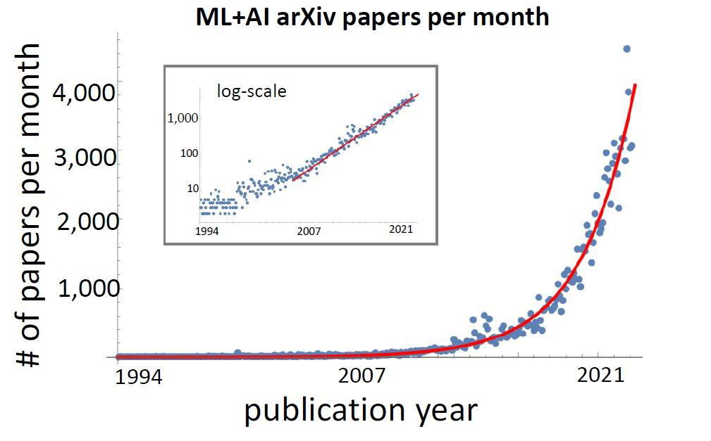

# Project Name : Paper-to-Speech
  \

### Contents Table
- [문제 상황](#문제-상황)
- [기대 효과](#기대효과)
- [Project 설명](#PROJECT-설명)  
- [모델 설명](#about-model)
- [Dataset](#Dataset)
- [Reference](#Reference) 

---
### 문제 상황

인공지능 분야는 매 년, 매 분기 다양한 구조의 모델이 새롭게 발표된다. 
시간이 부족함!

### 기대효과 

### PROJECT 설명 

### ABOUT MODEL

### Dataset

#### 적용할 수 있는 분야 

## ReFerence 

|Reference|Git|paper_link|
|:--:|:--:|:--:|
|Prajwal, K. R., et al. "A lip sync expert is all you need for speech to lip generation in the wild." Proceedings of the 28th ACM International Conference on Multimedia. 2020.|[Wav_2Lip](https://github.com/Rudrabha/Wav2Lip)| [paper](https://arxiv.org/pdf/2008.10010v1.pdf)|
|Zhou, Yang, et al. "Makelttalk: speaker-aware talking-head animation." ACM Transactions On Graphics (TOG) 39.6 (2020): 1-15.|[MakeItTalk](https://github.com/yzhou359/MakeItTalk) | [paper](https://arxiv.org/pdf/2004.12992v3.pdf)|
|[end-to-end speech processing toolkit](https://espnet.github.io/espnet/)|[ESPNET(JETS)](https://github.com/espnet/espnet) | [paper](https://arxiv.org/abs/2203.16852) |
|TANG, Jiaxiang, et al. Real-time Neural Radiance Talking Portrait Synthesis via Audio-spatial Decomposition. arXiv preprint arXiv:2211.12368, 2022.|[Rad-NeRF](https://github.com/ashawkey/RAD-NeRF)| [paper](https://arxiv.org/abs/2211.12368)
|LIM, Dan; JUNG, Sunghee; KIM, Eesung. JETS: Jointly training FastSpeech2 and HiFi-GAN for end to end text to speech. arXiv preprint arXiv:2203.16852, 2022.|[JETS](https://github.com/imdanboy/jets)| [paper](https://arxiv.org/pdf/2203.16852v2.pdf)
|HUMEAU, Samuel, et al. Poly-encoders: Transformer architectures and pre-training strategies for fast and accurate multi-sentence scoring. arXiv preprint arXiv:1905.01969, 2019.|[Poly-Encoder](https://github.com/chijames/Poly-Encoder)| [paper](https://arxiv.org/pdf/1905.01969v4.pdf)

## Enviroment

| Env |CPU | GPU | RAM | OS 
|:--:|:--:|:--:|:--:|:--:|
| Local | i5- 10400F | RTX-3080(12G) | 32G| Window10 |
| AWS |  AMD-EPYC-7R32 | RTX-3090| 12G| Ubuntu |
| Colab + | intel Xeon | A100 | 80G | Ubuntu |
